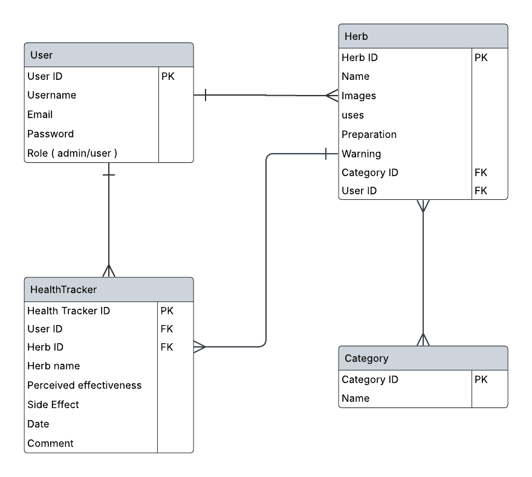
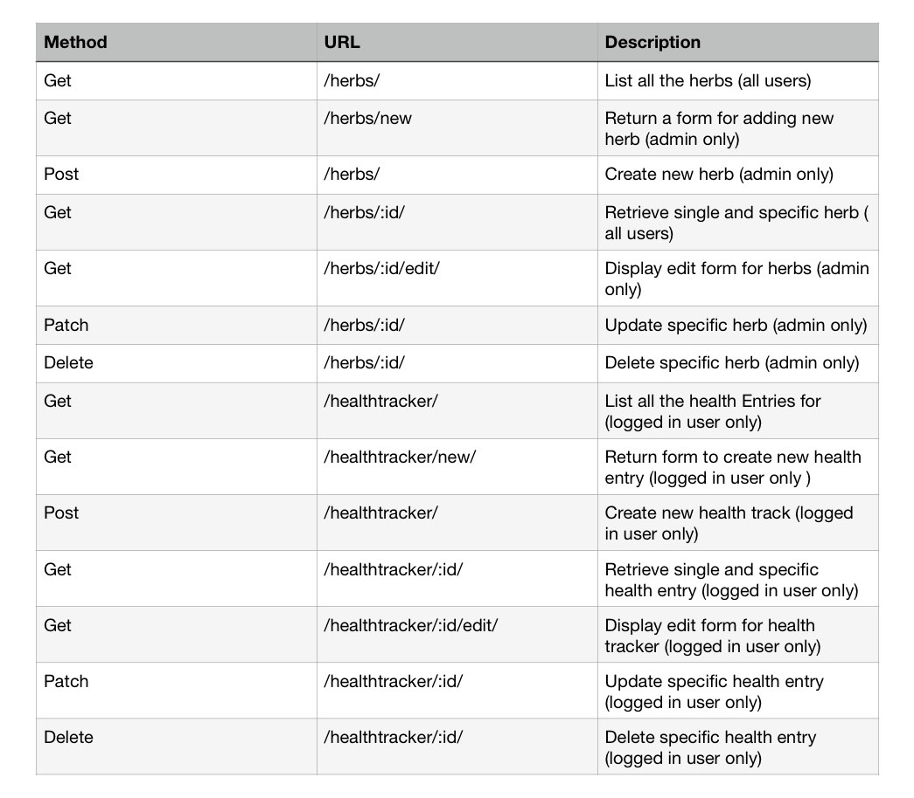

# Herbal Medicine Tracker 

## Project Description 
Herbal Medicine Tracker is a  web application designed to help users learning about medicinal herbs and monitoring their individual experiences using herbal treatments for health and wellness. It is bulit with Django and Django REST framework to handle user authentication, role-base permissions.

## Technological stack
Backend:
- Django
- Django Rest Framework (DRF)
- Json Web Token (JWT) for Authentication
- Django-cors-headers

Fronend:
- React.js
- Bulma
- JSX
- CSS
- React Router
- State management (using React hook)

## Frontend Repository
[Go to Frontend Repository](https://github.com/Waad-alharbi/herbs-frontend)

## Code Installation
1 - Clone the repository
- `git clone https://github.com/Waad-alharbi/herbs-frontend.git`

2 - Navigate into the folder
- `cd herbs_backend`

3 - Open the folder in the editor
- `code .`

In Visual Studio Code Terminal:

4 - Run the backend server
- Mac : `python3 manage.py runserver`
- Windows: `python manage.py runserver`

## Planning
- Designed Entity Relatioship Diagram (ERD) to map the data structure.

- Documented a Routing Table for the API endpoints and methods

### ERD

### Routing Table

## Key Learnings
- Gained experience with Django REST framework.

- Applying permissions for role-based access.

- Securing the users login and registeration by using JWT authentication.

## Future Features
Due to time constraints, some features were not implemented which include: 

- Implementing search functionality for herbs by filtering the catagories to enhance user experience.
- Allowing users to save favorite herbs to explore later.
- Improving readability and useability of user interface.

